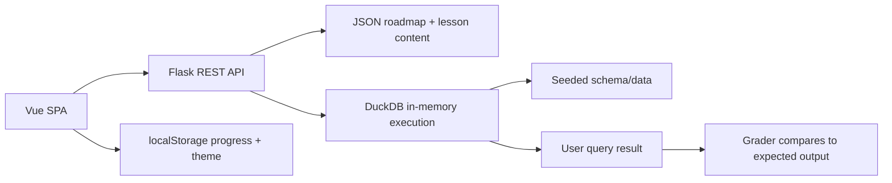

# LeetPrep-SQL

LeetPrep-SQL is a Flask + Vue 3 SQL practice platform for building the query patterns used in LeetCode-style database interviews. It combines a JSON-authored learning roadmap, in-browser progress tracking, and DuckDB-backed query execution for lesson and boss-problem practice.

## Summary

- Guided SQL learning path from core patterns to advanced interview problems
- Lesson flow: tutorial -> guided example -> practice -> boss problem
- Browser-local progress storage, no login required
- Safe SQL execution with read-only query validation

## Overview

The app is split into two parts:

- `backend/` exposes REST endpoints for roadmap content, lesson execution, grading, health checks, and placeholder standalone problems
- `frontend/` provides the Vue single-page app for the dashboard, roadmap, module pages, lesson workspace, and boss-problem workspace

Learning content is authored as JSON in `backend/learning_content/` and loaded at runtime. Queries run against temporary in-memory DuckDB databases seeded from the lesson or boss-problem definitions.

## Features

- 10-module SQL roadmap with ordered progression
- Module gating based on prior completion
- Lesson workspaces with:
  - tutorial content
  - guided example
  - practice prompt
  - schema viewer
  - sample data viewer
  - expected output preview
  - hints
- Boss problems unlocked after all lessons in a module are complete
- Query execution and submission grading
- SQL safety checks that allow only read-only learner queries
- Local progress persistence in `localStorage`
- Theme persistence in `localStorage`
- Frontend caching for roadmap/module/lesson/boss fetches

## Screenshots

TODO: Add screenshots or GIFs of:

- Dashboard
- Roadmap overview
- Lesson workspace
- Boss-problem workspace

## Tech Stack

| Area | Tools |
| --- | --- |
| Backend API | Flask, Flask-CORS |
| Backend data layer | Flask-SQLAlchemy, SQLite default app DB |
| Query engine | DuckDB |
| SQL validation | sqlglot |
| Data handling | pandas |
| Frontend | Vue 3, Vue Router |
| Frontend tooling | Vite |
| Testing | pytest, Vitest, Playwright |
| Deployment helpers | Gunicorn, Vercel Speed Insights |

## Architecture / Data Flow



Request flow:

1. The frontend loads roadmap or module data from `/api/roadmap` and `/api/modules/...`.
2. Lesson and boss pages fetch authored JSON content from the backend.
3. Learner SQL is validated for safety before execution.
4. Queries run in an isolated in-memory DuckDB connection seeded with the lesson schema and data.
5. Grading compares user output against the expected result.
6. Completion state is stored locally in the browser.

## Project Structure

```text
backend/
  app/
    api/         REST blueprints for health, learning, problems, attempts
    services/    JSON loaders, DuckDB runner, grading, problem generation
    models/      Future SQLAlchemy models
    utils/       SQL safety helpers
  learning_content/
    roadmap.json
    modules/     Lesson and boss-problem JSON content
  scripts/       Validation and seed/helper scripts
  tests/         Backend test suite
frontend/
  src/
    api/         API client wrappers
    components/  UI, learning, roadmap, and layout components
    composables/ Workspace logic
    pages/       Route-level pages
    router/      Vue Router setup
    services/    localStorage helpers for progress and theme
    assets/      Global styles
```

## Installation

### Prerequisites

- Python 3.11+
- Node.js 22+
- npm

### Backend

```powershell
cd backend
python -m venv .venv
.\.venv\Scripts\Activate.ps1
pip install -r requirements.txt
python run.py
```

The API runs at `http://localhost:5000`.

### Frontend

```powershell
cd frontend
npm install
npm run dev
```

The app runs at `http://localhost:5173`.

## Configuration

### Backend environment variables

Copy `backend/.env.example` to `backend/.env` and adjust as needed.

| Variable | Purpose | Default |
| --- | --- | --- |
| `SECRET_KEY` | Flask secret key | `dev-secret-key-change-me` |
| `DATABASE_URL` | App database connection string | SQLite file in `backend/instance/leetprep_sql.db` |
| `PROBLEMS_DIR` | Location for standalone problem JSON | `backend/problems` |
| `CORS_ORIGINS` | Allowed frontend origins | `http://localhost:5173,http://localhost:5174,https://leetprepsql.vercel.app` |
| `FRONTEND_ORIGIN` | Alternate CORS origin override | same as above when set |
| `SQL_MAX_QUERY_LENGTH` | Maximum learner query length | `5000` |
| `SQL_MAX_RESULT_ROWS` | Maximum returned rows | `200` |
| `SQL_QUERY_TIMEOUT_SECONDS` | Execution timeout | `5` |
| `DUCKDB_MEMORY_LIMIT` | DuckDB memory cap | `128MB` |

### Frontend environment variables

TODO: The repo references `frontend/.env.example` in the README and code comments, but no frontend env example file is present in the repository snapshot.

The frontend API base URL is configured through `VITE_API_BASE_URL`.

## Usage

### Main routes

- `/` dashboard
- `/roadmap` roadmap overview
- `/roadmap/:moduleId` module page
- `/roadmap/:moduleId/lessons/:lessonId` lesson workspace
- `/roadmap/:moduleId/boss` boss-problem workspace
- `/problems` standalone problem list
- `/problems/:id` standalone problem detail

### Key API endpoints

| Method | Endpoint | Purpose |
| --- | --- | --- |
| GET | `/api/health` | Health check |
| GET | `/api/roadmap` | Full roadmap metadata |
| GET | `/api/modules` | Module list |
| GET | `/api/modules/<module_id>` | Module detail with lesson summaries |
| GET | `/api/modules/<module_id>/lessons/<lesson_id>` | Lesson detail |
| POST | `/api/modules/<module_id>/lessons/<lesson_id>/run` | Run lesson SQL |
| POST | `/api/modules/<module_id>/lessons/<lesson_id>/submit` | Grade lesson SQL |
| GET | `/api/modules/<module_id>/boss` | Boss-problem detail |
| POST | `/api/modules/<module_id>/boss/run` | Run boss SQL |
| POST | `/api/modules/<module_id>/boss/submit` | Grade boss SQL |
| GET | `/api/problems` | Standalone problem list placeholder |
| GET | `/api/problems/<problem_id>` | Standalone problem detail placeholder |
| POST | `/api/problems/<problem_id>/run` | Standalone problem runner placeholder |
| POST | `/api/problems/<problem_id>/submit` | Standalone problem grader placeholder |
| GET | `/api/attempts` | Attempt list placeholder |

### Local workflow

1. Start the backend.
2. Start the frontend.
3. Open `http://localhost:5173/roadmap`.
4. Complete lessons in order to unlock later lessons and boss problems.
5. Use Run to inspect results before submitting.

### Validation and tests

Backend:

```powershell
cd backend
.\.venv\Scripts\python.exe -m pytest
.\.venv\Scripts\python.exe scripts\validate_learning_content.py
```

Frontend:

```powershell
cd frontend
npm run lint
npm run test
npm run build
npm run test:e2e
```

### Content authoring

- Roadmap metadata: `backend/learning_content/roadmap.json`
- Module lessons and boss problems: `backend/learning_content/modules/`

TODO: The repo includes validation scripts for learning content, but standalone problem content under `backend/problems/` is still not authored.

## Future Improvements

- Persist attempts and progress in the backend database
- Add authentication and per-user accounts
- Author standalone practice problems under `backend/problems/`
- Expand the roadmap with more beginner-friendly onboarding
- Add richer SQL editor support
- Add daily streak tracking with backend persistence
- Serve the frontend from the Flask app for a single deployment target

## License

MIT

See [`LICENSE`](./LICENSE) for the full text.
